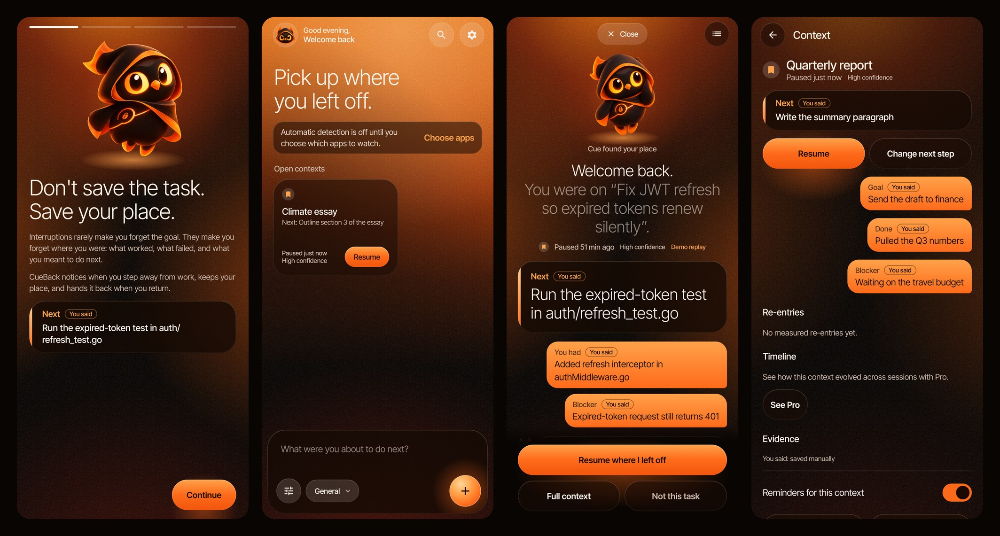
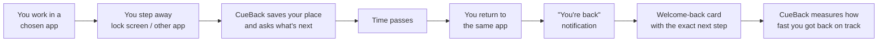
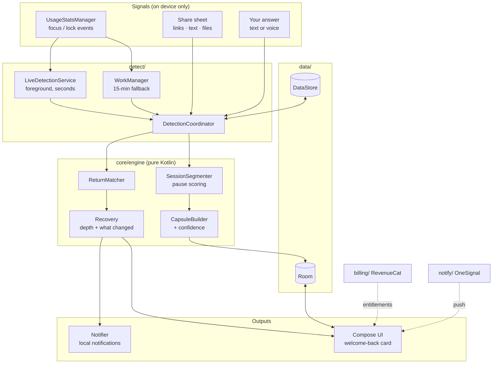

<div align="center">

# CueBack

### The resume button for your brain

**Don't save the task. Save your place.**

CueBack notices when you step away from work on your phone, keeps your place, and hands you the exact next step when you come back.

[](https://github.com/LSUDOKO/CueBack/actions/workflows/android.yml)


[](LICENSE)



<sub>Rendered by the app's own UI tests. The welcome-back card uses the built-in demo story, which runs through the real engine. The owl is Cue, who keeps your place.</sub>

</div>

---

## Contents

- [The problem](#the-problem)
- [How it works](#how-it-works)
- [Features](#features)
- [Project status](#project-status)
- [Getting started](#getting-started)
- [Architecture](#architecture)
- [Privacy](#privacy)
- [Testing](#testing)
- [Tech stack](#tech-stack)
- [Documentation](#documentation)
- [License](#license)

## The problem

Interruptions rarely make you forget the goal. They make you forget **where you were**: what you had already done, what was failing, and what you meant to do next. Research on task resumption calls this *resumption lag*: the minutes spent rebuilding working context before you can act again.

To-do apps record *what* needs doing. CueBack records the **working state you need to continue**, and gives back only as much of it as the length of the break calls for.

## How it works



1. **Pick the apps where your real work happens** (browser, docs, terminal, notes). CueBack watches only those.
2. **When you step away**, a pause scorer weighs the signals: screen lock, switching to an unwatched app, time idle. When it's confident, it closes the session into a *context capsule*.
3. **It asks one question:** *"What were you about to do next?"* You can answer inline from the notification, by voice or text, in a few seconds.
4. **When you return**, a matcher recognizes the context and picks how much to show. A short break gets a one-line cue; a long one gets a full reconstruction with what changed while you were away.
5. **Every fact is labelled with where it came from**: `Detected`, `Inferred`, `You said`, or `Unknown`. CueBack never presents a guess as a fact.

## Features

| | Free | Pro |
|---|:---:|:---:|
| Automatic pause and return detection | 1 app | Unlimited apps |
| Open contexts | 3 | Unlimited |
| Welcome-back card (micro cue and recovery card) | ✓ | ✓ |
| Full reconstruction: goal, work done, artifacts, what changed | — | ✓ |
| Manual "Save my place" and share-to-CueBack for links, text and files | ✓ | ✓ |
| Voice capture of the next step | — | ✓ |
| Context timeline and one smart reminder for work left waiting | — | ✓ |
| Re-entry time measurement ("Typically back in 2 min") | ✓ | ✓ |
| JSON export and delete-everything | ✓ | ✓ |
| Optional cloud AI refinement (off by default, bring your own endpoint) | ✓ | ✓ |

Other details:
- **Reopens your exact spot.** Links shared to CueBack reopen at the same page or anchor, through a scheme allowlist.
- **Respectful notifications.** Quiet hours, lock-screen privacy (only *"Your next action is ready"*), and at most one reminder per context.
- **Two detection modes.** Live detection recognizes returns within seconds using a small foreground service; without it, WorkManager checks every 15 minutes.
- **Cue, the owl.** An animated guide that hovers, glances around, reacts when tapped and changes pose with what the app is doing. All motion turns off with the system's reduced-motion setting.
- **One dark "ember" look** across every screen: glass panels on a lit, grainy backdrop, set in Inter Tight. See the [design system](docs/DESIGN_SYSTEM.md).

## Project status

**Overall: about 85% complete.** The app works end to end on a real phone. What remains is account configuration and store release work, not product code.

| Area | Status | Notes |
|---|:---:|---|
| Context engine: segmentation, capsules, confidence, matching, recovery depth, what changed, re-entry | ✅ Done | Pure Kotlin, 31 unit tests |
| Data layer: Room schema v1 (exported), repositories, DataStore settings | ✅ Done | |
| UI: onboarding, home, welcome-back card, capture, context detail, library and search, settings, paywall | ✅ Done | Compose, Material 3, dark ember design with the Cue mascot |
| Automatic detection: usage access, app picker, live service, periodic fallback | ✅ Done | **Verified on a real phone**: a 5.5-minute pause was detected, the return was recognized, and the notification opened the welcome-back card |
| Share target, voice capture, artifact relaunch | ✅ Done | |
| Privacy controls: pause collection, export, delete all, redaction, encrypted AI key | ✅ Done | Covered by privacy tests |
| RevenueCat billing: offerings, purchase, restore, entitlement gates | ✅ Code done | Test Store purchase verified on a device. ⚠️ Needs the `cueback_pro` entitlement created in the RevenueCat dashboard |
| OneSignal push: init, tags, outcomes, deep links | ✅ Code done | ⚠️ Needs Firebase (FCM) connected in the OneSignal dashboard before push can be delivered |
| CI: unit tests, lint, R8 release build on every push | ✅ Done | GitHub Actions |
| Store release: upload keystore, Play Console products, Google Play RevenueCat key, listing | ⏳ To do | Release builds are currently signed with the debug key |

See the [roadmap](docs/ROADMAP.md) for the phase-by-phase plan.

## Getting started

### Requirements

- Android Studio (latest stable) or the Android SDK command-line tools
- JDK 21
- An Android 9+ device or emulator

### Build and run

```bash
git clone https://github.com/LSUDOKO/CueBack.git
cd CueBack
cp local.properties.example local.properties   # then set sdk.dir and, optionally, your keys
./gradlew installDebug                          # build and install on a connected device
```

The app runs **without any keys**: billing and push show an explicit "not configured" state instead of fake data. To enable them, add to `local.properties` (never committed):

```properties
REVENUECAT_API_KEY=goog_xxx   # or a test_ key for RevenueCat's Test Store (debug builds only)
ONESIGNAL_APP_ID=xxxxxxxx-xxxx-xxxx-xxxx-xxxxxxxxxxxx
```

Full service setup (RevenueCat entitlement and offering, OneSignal and Firebase) is in [docs/SETUP.md](docs/SETUP.md).

### Try it in two minutes

1. Open CueBack and finish onboarding. Allow usage access and pick an app such as Chrome.
2. Debug builds: **Settings → Developer → Replay demo story** plays a recorded coding session through the real engine and opens the welcome-back card.
3. Real flow: use the chosen app for a minute, lock the phone (or switch to another app for 5+ minutes), then come back.

## Architecture

A single-module Android app with manual dependency injection (`AppContainer`). The engine is pure Kotlin with no Android dependencies, so it's fully unit-testable.



```text
app/src/main/java/com/cueback/app/
├── core/engine   segmentation, capsule builder, return matcher, recovery depth, config
├── core/model    domain models and provenance labels
├── data          Room database, DAOs, repositories, DataStore settings
├── detect        live detection service, WorkManager fallback, detection coordinator, demo fixture
├── platform      usage collector, app catalog, artifact launcher
├── billing       RevenueCat wrapper, entitlement state, feature gates
├── notify        local notifications, OneSignal, deep links, notification policy
├── ai            optional cloud refinement, redactor, Keystore-encrypted key store
└── ui            Compose screens and design system
```

More detail: [context engine](docs/CONTEXT_ENGINE.md) · [product spec](docs/PRODUCT_SPEC.md) · [UX spec](docs/UX_UI_SPEC.md)

## Privacy

CueBack is private by design:

- **Only the apps you choose**, and only *which app is in front* and *when the screen locks*. No screen capture, audio, keystrokes, messages, or content from other apps.
- **Everything stays on the phone.** No CueBack server exists.
- **Cloud AI is off by default.** When you turn it on, only a short, redacted summary goes to the endpoint you configure. Tokens and keys are stripped first.
- **You're in control:** pause collection, export everything as JSON, or delete everything from Settings.

Read the [privacy policy](PRIVACY_POLICY.md) and the [privacy and security design](docs/PRIVACY_SECURITY.md).

## Testing

```bash
./gradlew :app:testDebugUnitTest   # 65 JVM tests (engine, data, privacy, UI flows via Robolectric)
./gradlew :app:lintDebug
./gradlew :app:assembleRelease     # R8-minified release build
```

| Suite | Tests | Covers |
|---|:---:|---|
| `SessionSegmenterTest` · `ContextEngineTest` · `MatcherAndDepthTest` | 31 | Pause scoring, capsules, confidence, return matching, recovery depth, what changed |
| `EndToEndTest` | 7 | Real engine and database: pause, capture, return, welcome-back card, re-entry |
| `UiFlowTest` | 6 | Onboarding, demo welcome-back card, manual capture, context detail, notification deep link, settings. Saves screenshots to `app/build/ui-screens` |
| Policy and privacy suites | 21 | Notification policy, deep links, feature gates, artifact scheme allowlist, share parsing, redaction, AI opt-in, usage mapping |

Beyond the automated tests, the full pause-and-return loop, the notification deep link and Test Store purchases (valid, failed, cancelled, restore) have been checked by hand on a physical Android 15 phone.

## Tech stack

| | |
|---|---|
| Language | Kotlin 2.4, coroutines, kotlinx.serialization |
| UI | Jetpack Compose, Material 3, Navigation Compose |
| Storage | Room 2.8 (exported schema), DataStore |
| Background | Foreground service (`specialUse`), WorkManager 2.12 |
| Monetization | RevenueCat 10.23 |
| Push | OneSignal 5.10 |
| Build | AGP 9.4, Gradle version catalog, R8 |
| Testing | JUnit, Robolectric 4.17, Compose UI test |
| Platform | minSdk 28 (Android 9), targetSdk 36 |

## Documentation

| Document | What's inside |
|---|---|
| [docs/SETUP.md](docs/SETUP.md) | Build, keys, RevenueCat, OneSignal and Firebase setup |
| [docs/ROADMAP.md](docs/ROADMAP.md) | Scope, build phases and status |
| [docs/CONTEXT_ENGINE.md](docs/CONTEXT_ENGINE.md) | How pauses, capsules and returns are detected |
| [docs/PRODUCT_SPEC.md](docs/PRODUCT_SPEC.md) | Product definition and requirements |
| [docs/DESIGN_SYSTEM.md](docs/DESIGN_SYSTEM.md) | Colours, type, components, the mascot and motion rules |
| [docs/UX_UI_SPEC.md](docs/UX_UI_SPEC.md) | Screens, states and interaction rules |
| [docs/PRIVACY_SECURITY.md](docs/PRIVACY_SECURITY.md) | Privacy and security design |
| [docs/MONETIZATION.md](docs/MONETIZATION.md) | Free and Pro tiers, paywall |
| [docs/PUSH_AND_RETENTION.md](docs/PUSH_AND_RETENTION.md) | Notification and retention strategy |
| [docs/TESTING_STRATEGY.md](docs/TESTING_STRATEGY.md) | Quality principles and test plan |
| [docs/RESEARCH.md](docs/RESEARCH.md) | Research on interruption and task resumption |
| [docs/HACKATHON_SUBMISSION.md](docs/HACKATHON_SUBMISSION.md) | Shipaton 2026 submission |
| [docs/design/](docs/design/) | Original multi-platform design (desktop and backend, out of scope for this release) |

## Contributing

Issues and pull requests are welcome. See [CONTRIBUTING.md](CONTRIBUTING.md). To report a security problem, see [SECURITY.md](SECURITY.md).

## License

Licensed under the [Apache License 2.0](LICENSE).
