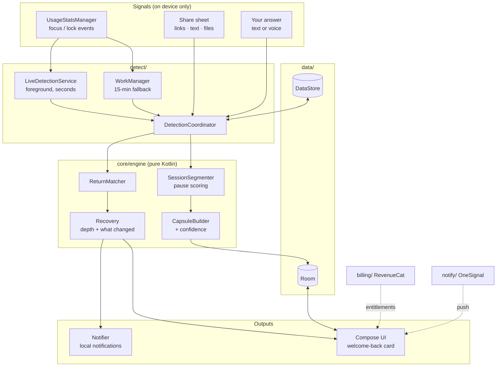

<div align="center">


### The resume button for your brain

**Don't save the task. Save your place.**

CueBack is an Android app that notices when you step away from work on your phone,<br>keeps your place, and hands you the exact next step when you come back.

[](https://github.com/LSUDOKO/CueBack/actions/workflows/android.yml)


[](LICENSE)

[Website](https://lsudoko.github.io/CueBack/) · [Demo video script](docs/demo/SCRIPT.md) · [Setup](docs/SETUP.md) · [Business model](docs/BUSINESS_MODEL.md) · [Privacy](PRIVACY_POLICY.md)

</div>

<p align="center">
  
</p>

<p align="center"><sub>Built for RevenueCat Shipaton 2026, Next Gen (student) track. Open source under Apache 2.0.</sub></p>

---

## Contents

- [The problem](#the-problem)
- [How it works](#how-it-works)
- [Not just for studying](#not-just-for-studying)
- [Screens](#screens)
- [Features](#features)
- [Business model](#business-model)
- [Privacy](#privacy)
- [How to use CueBack from this repo](#how-to-use-cueback-from-this-repo)
- [Architecture](#architecture)
- [Tech stack](#tech-stack)
- [Testing](#testing)
- [Project status](#project-status)
- [Documentation](#documentation)
- [Contributing](#contributing) · [License](#license) · [Credits](#credits)

## The problem

It's 9:14 pm, the night before a test. You're on problem 7, you've just worked out that 7b is wrong because you forgot to convert kilometres to metres, and you know exactly what to try next. Then the group chat lights up.

Twenty minutes later you're back in the browser, scrolling up and down the page, trying to remember what you were about to do.

Interruptions rarely make you forget the goal. They make you forget **where you were**: what you'd already done, what was failing, and what you meant to do next. Research on task resumption calls this *resumption lag*. To-do apps record *what* needs doing. CueBack records **the working state you need to continue**, and gives back only as much of it as the length of the break calls for.

## How it works

The whole loop below was recorded on a real phone (a Moto g34 on Android 15). The pause and the return were detected by the live app, not staged.

<table>
  <tr>
    <td align="center" width="50%">
      <br>
      <b>1. Save your place.</b><br>Share the page to CueBack and write the next step in your own words.
    </td>
    <td align="center" width="50%">
      <br>
      <b>2. You're back.</b><br>Open the same app later and CueBack notices, with your next step in the notification.
    </td>
  </tr>
  <tr>
    <td align="center" width="50%">
      <br>
      <b>3. Welcome back, then Resume.</b><br>The card leads with your next step. Resume reopens the exact page you saved.
    </td>
    <td align="center" width="50%">
      <br>
      <b>4. Back in 21 seconds.</b><br>CueBack measures how long it took to get back to real work.
    </td>
  </tr>
</table>

<p align="center">
  
</p>

Everything runs on the phone, in a small context engine written in pure Kotlin:

- **Pause score.** CueBack watches only the apps you pick, and only which one is in front and when the screen locks. Signals add up to a pause score: locking the screen weighs 0.60, switching to an app you didn't pick 0.35, being away for 5 minutes 0.30. At 0.60 the session closes. In practice, a pause counts after **30 seconds locked** or **5 minutes in another app**.
- **Context capsules.** A closed session becomes a capsule: the app, what you shared, your notes, and a confidence score. If the confidence is low, CueBack asks one question, *"What were you about to do next?"*, which you can answer from the notification.
- **Provenance labels.** Every fact on the welcome-back card says where it came from: `Detected`, `Inferred`, `You said` or `Unknown`. CueBack never presents a guess as a fact.
- **Return matching.** When you open a watched app again, a matcher scores the open capsules on app, artifacts, keywords and recency, and only interrupts you when it's confident. Returns within 2 minutes reattach silently, so a quick glance at a message doesn't trigger anything.
- **Recovery depth.** A break under 5 minutes gets a one-line cue. A longer one gets the recovery card. After 2 hours, or when a lot changed, you get a full reconstruction: goal, work done, artifacts and what happened while you were away.

Every threshold lives in one file, [`EngineConfig.kt`](app/src/main/java/com/cueback/app/core/engine/EngineConfig.kt). They're engineering defaults, meant to be tuned, not scientific constants. More in [docs/CONTEXT_ENGINE.md](docs/CONTEXT_ENGINE.md).

## Not just for studying

<p align="center">
  
</p>

CueBack works in any app you choose to watch, and with anything you can share:

- **A lecture video, at the minute you left.** Share the video from YouTube and note the minute you stopped at.
- **A code review, on the file you were checking.** Share the GitHub page and note the line you were about to comment on.
- **Research for an essay, on the article you were citing.** Save the page and the sentence you were paraphrasing.
- **A long application form.** Save the page and what's still missing. With Pro, you get one reminder if you leave it waiting.

<p align="center">
  <br>
  <sub>Every place you've saved lives in the library, searchable, one tap from Resume.</sub>
</p>

## Screens

<p align="center">
  
</p>

<details open>
<summary><b>Every screen</b></summary>
<br>

**Setting up**

<table>
  <tr>
    <td align="center"><br><sub>Meet Cue</sub></td>
    <td align="center"><br><sub>Private by design</sub></td>
    <td align="center"><br><sub>Tuned to your work</sub></td>
    <td align="center"><br><sub>Three switches</sub></td>
  </tr>
</table>

**Saving your place**

<table>
  <tr>
    <td align="center"><br><sub>Home, first run</sub></td>
    <td align="center"><br><sub>Save your place</sub></td>
    <td align="center"><br><sub>Home</sub></td>
    <td align="center"><br><sub>Library</sub></td>
  </tr>
</table>

**Coming back**

<table>
  <tr>
    <td align="center"><br><sub>Welcome back</sub></td>
    <td align="center"><br><sub>Measuring</sub></td>
    <td align="center"><br><sub>Back in 21 seconds</sub></td>
    <td align="center"><br><sub>Context detail</sub></td>
  </tr>
  <tr>
    <td align="center"><br><sub>Settings</sub></td>
    <td></td><td></td><td></td>
  </tr>
</table>

</details>

## Features

| | Free | Pro |
|---|:---:|:---:|
| Automatic pause and return detection | 1 app | Unlimited apps |
| Open contexts | 3 | Unlimited |
| Welcome-back card (micro cue and recovery card) | ✓ | ✓ |
| Full reconstruction: goal, work done, artifacts, what changed | — | ✓ |
| "Save my place" and share to CueBack for links, text and files | ✓ | ✓ |
| Voice capture of the next step | — | ✓ |
| Context timeline and one smart reminder for work left waiting | — | ✓ |
| Re-entry measurement ("Back in 21 seconds", "Typically back in 2 min") | ✓ | ✓ |
| JSON export and delete everything | ✓ | ✓ |
| Optional cloud AI refinement (off by default, bring your own endpoint) | ✓ | ✓ |

Also:

- **Reopens your exact spot.** Links shared to CueBack reopen at the same page or anchor, through a scheme allowlist.
- **Respectful notifications.** Quiet hours (22:00–07:00 by default), lock-screen privacy (only *"Your next action is ready"*), and at most one reminder per context.
- **Two detection modes.** Live detection recognizes returns within seconds using a small foreground service. Without it, WorkManager checks every 15 minutes.
- **Cue, the owl.** An animated guide that hovers, glances around, leans as you tilt the phone, reacts when tapped and changes pose with what the app is doing. All motion stops when the system's animations are turned off.
- **One dark "Ember" look** across every screen: smoked-glass panels on a lit, grainy backdrop, set in Inter Tight. See the [design system](docs/DESIGN_SYSTEM.md).

## Business model

<p align="center">
  
</p>

CueBack is freemium, with billing through [RevenueCat](https://www.revenuecat.com). The full write-up is in [docs/BUSINESS_MODEL.md](docs/BUSINESS_MODEL.md).

**Who pays, and why.** The cost of an interruption grows with the number of things you're juggling. One problem set in one browser is fully covered by Free, which is enough to feel the product work. People with several open loops across several apps (students with lectures, readings and problem sets; developers with code reviews; researchers with a stack of articles) hit the Free limits, and they're also the ones CueBack saves the most time.

**Free and Pro.** The limits come from [`FeatureGate.kt`](app/src/main/java/com/cueback/app/billing/FeatureGate.kt):

- Free watches **1 app** and keeps **3 open contexts**. When automatic detection needs a fourth, the oldest moves to the library archive instead of blocking anything.
- Pro unlocks unlimited apps and contexts, the full reconstruction, voice capture, the context timeline and smart reminders.
- Export, delete-everything and the welcome-back card are never paywalled.

**Plans.** The app shows whatever the current RevenueCat offering contains. The Test Store configuration has three:

| Plan | Price |
|---|---|
| Annual (default, with its per-month price shown) | $79.99 / year |
| Monthly | $9.99 / month |
| Lifetime | $99.99 once |

These are starting prices to test, not market findings.

**Value first.** The paywall opens once, **right after your first successful return**, when CueBack has just said "Back in 21 seconds". Its headline is "Keep that continuity across every project." It never blocks the core loop: *Continue free* is always one tap away, and after that first time the paywall appears only when you reach for a Pro feature or tap *See Pro*.

<p align="center">
  <br>
  <sub>A real RevenueCat Test Store purchase on the phone, ending on "You have CueBack Pro".</sub>
</p>

**How RevenueCat is integrated** ([`billing/`](app/src/main/java/com/cueback/app/billing/)):

- **Offerings.** Plans load live from `offerings.current`, with store-formatted prices and any free trial. Product IDs are free-form.
- **Purchase and restore** go through the SDK, with clear messages for cancelled ("Nothing was charged"), pending and failed purchases, and for a restore that finds nothing.
- **One source of truth.** Pro is unlocked only when the **`cueback_pro`** entitlement is active in `CustomerInfo`. Nothing in the app can set Pro locally. With no key, billing shows an explicit "not configured" state instead of fake plans.
- **Privacy.** RevenueCat gets a random ID generated on the phone (`cb_…`), never a name, email or task content.
- **Test Store for development, `goog_` key for release.** Release builds drop a `test_` key on purpose, because Test Store keys crash the SDK in non-debuggable builds.

**Verified on a real phone:** plans load live from the offering, a valid Test Store purchase unlocks `cueback_pro` and survives restarts, Restore works, failed and cancelled purchases show clear messages, and the purchase controls hide once you have Pro.

**What RevenueCat gives us:** prices and packages that change from the dashboard without an app release, Experiments for testing prices and a trial, charts and a per-customer entitlement history, and receipt validation without a CueBack backend.

**Next:** Google Play products and the `goog_` key, a price experiment, a free trial on annual, paywall copy variants, and promo access for judges. CueBack isn't on the Play Store yet, so there's no revenue to report; the dashboard holds only Test Store sandbox data from our own testing.

## Privacy

CueBack is private by design:

- **Only the apps you choose**, and only *which app is in front* and *when the screen locks*. No screen capture, audio, keystrokes, messages or content from other apps.
- **Everything stays on the phone.** There is no CueBack server and no CueBack account.
- **Cloud AI is off by default.** Turn it on and only a short, redacted summary goes to the endpoint you configure. Tokens and keys are stripped first, and your API key is encrypted with the Android Keystore.
- **You're in control.** Pause collection, export everything as JSON, or delete everything from Settings.

Read the [privacy policy](PRIVACY_POLICY.md) and the [privacy and security design](docs/PRIVACY_SECURITY.md).

## How to use CueBack from this repo

CueBack isn't on the Play Store yet. You can build it and install it on your own Android phone. No keys are needed.

### 1. What you need

- A computer with **JDK 21** and the **Android SDK** (the easiest way to get both is [Android Studio](https://developer.android.com/studio))
- An **Android 9 or later** phone and a USB cable (an emulator works too, but automatic detection is best tried on a real phone)
- Git

### 2. Get the code

```bash
git clone https://github.com/LSUDOKO/CueBack.git
cd CueBack
cp local.properties.example local.properties
```

Open `local.properties` and set `sdk.dir` to your Android SDK path (Android Studio shows it under *Settings → Languages & Frameworks → Android SDK*). Leave the two keys blank for now. This file is git-ignored and never committed.

### 3. Connect your phone

1. On the phone, open **Settings → About phone** and tap **Build number** seven times to turn on Developer options.
2. Open **Developer options** and switch on **USB debugging**.
3. Plug the phone in and accept the *Allow USB debugging?* prompt.
4. Check that it's connected:

```bash
adb devices   # your phone should be listed as "device"
```

### 4. Build and install

```bash
./gradlew installDebug
```

CueBack appears in your app drawer.

### 5. First run

<table>
  <tr>
    <td width="300" align="center"></td>
    <td>

1. **Meet Cue** and read what CueBack sees and never records.
2. **Pick what you mostly do** (coding, study, writing, research, design or general). It only tunes wording.
3. **Allow usage access.** Android opens a list; switch CueBack on.
4. **Choose apps to watch,** for example Chrome. Free watches one.
5. **Allow notifications,** so CueBack can say "You're back" and ask what's next.
6. **Turn on live detection** to recognize returns within seconds. It shows a small persistent notification.

Every step is optional. Skip them and you can still save your place by hand.

</td>
  </tr>
</table>

### 6. Try it in two minutes

The quickest way to see the welcome-back card, in debug builds:

1. Open **Settings → Developer → Replay demo story**.
2. CueBack plays a recorded coding session (a JWT refresh bug) through the real engine and opens the welcome-back card. Demo contexts are labelled and can be deleted.

Then try the real loop:

1. Open the app you chose to watch (say Chrome) and use it for at least a minute.
2. Share the page to CueBack and write your next step, or just carry on.
3. Lock the phone for more than 30 seconds, or spend more than 5 minutes in another app.
4. Come back to Chrome. You'll get a *"You're back in Chrome"* notification; tap it for the welcome-back card, then **Resume**.

### 7. Optional: turn on billing and push

The app runs fully without keys. Billing and push then show a clear "not configured" state. To try them, add to `local.properties`:

```properties
REVENUECAT_API_KEY=test_xxx   # RevenueCat Test Store key, debug builds only (goog_xxx for release)
ONESIGNAL_APP_ID=xxxxxxxx-xxxx-xxxx-xxxx-xxxxxxxxxxxx
```

- **RevenueCat:** create an entitlement named exactly **`cueback_pro`**, attach your products, and mark an offering containing them as *Current*.
- **OneSignal:** create an app, then upload a Firebase service-account JSON under *Settings → Push & In-App → Google Android (FCM)*.

Rebuild with `./gradlew installDebug`. Step-by-step instructions are in [docs/SETUP.md](docs/SETUP.md).

### Troubleshooting

| What you see | Why, and what to do |
|---|---|
| No notifications in the evening | Quiet hours hold them back from 22:00 to 07:00 by default. Turn quiet hours off in CueBack's Settings when testing at night |
| Nothing happens when you leave | A pause counts only after 30 seconds with the screen locked, or 5 minutes in another app. Without a saved note or link, a session also needs at least a minute in a watched app |
| Nothing happens when you come back | Returns within 2 minutes reattach silently. Stay away longer, and stay in the app for about 15 seconds so the return counts |
| Returns are only noticed after a while | Live detection is off, so CueBack checks every 15 minutes. Turn it on in Settings → Detection |
| Only one of your apps is watched | Free watches one app, the first alphabetically by package name |
| Settings says "Billing isn't configured in this build" | No `REVENUECAT_API_KEY` in `local.properties`. Add one and rebuild |
| A purchase succeeds but Pro doesn't unlock | The entitlement isn't named `cueback_pro`. Check the customer page in the RevenueCat dashboard |
| A release build has no billing | Expected with a `test_` key. Release builds need the `goog_` key |

Handy commands for testing:

```bash
adb shell appops set com.cueback.app GET_USAGE_STATS allow                  # grant usage access
adb shell pm grant com.cueback.app android.permission.POST_NOTIFICATIONS    # allow notifications
```

## Architecture

A single-module Android app with manual dependency injection (`AppContainer`). The engine is pure Kotlin with no Android dependencies, so it's fully unit-testable.



```text
app/src/main/java/com/cueback/app/
├── core/engine   segmentation, capsule builder, return matcher, recovery depth, config
├── core/model    domain models and provenance labels
├── data          Room database, DAOs, repositories, DataStore settings
├── detect        live detection service, WorkManager fallback, detection coordinator, demo fixture
├── platform      usage collector, app catalog, artifact launcher
├── billing       RevenueCat wrapper, entitlement state, feature gates
├── notify        local notifications, OneSignal, deep links, notification policy
├── ai            optional cloud refinement, redactor, Keystore-encrypted key store
└── ui            Compose screens and design system
```

More detail: [context engine](docs/CONTEXT_ENGINE.md) · [product spec](docs/PRODUCT_SPEC.md) · [UX spec](docs/UX_UI_SPEC.md) · [design system](docs/DESIGN_SYSTEM.md)

## Tech stack

| | |
|---|---|
| Language | Kotlin 2.4, coroutines, kotlinx.serialization |
| UI | Jetpack Compose, Material 3, Navigation Compose |
| Storage | Room 2.8 (exported schema), DataStore |
| Background | Foreground service (`specialUse`), WorkManager 2.12 |
| Monetization | RevenueCat 10.23 |
| Push | OneSignal 5.10, Firebase Cloud Messaging |
| Build | AGP 9.4, Gradle version catalog, R8 |
| Testing | JUnit, Robolectric 4.17, Compose UI test |
| Platform | minSdk 28 (Android 9), targetSdk 36 |

## Testing

```bash
./gradlew :app:testDebugUnitTest   # 65 JVM tests (engine, data, privacy, UI flows via Robolectric)
./gradlew :app:lintDebug
./gradlew :app:assembleRelease     # R8-minified release build
```

CI runs all three on every push to `main` and on every pull request.

| Suite | Tests | Covers |
|---|:---:|---|
| `SessionSegmenterTest` · `ContextEngineTest` · `MatcherAndDepthTest` | 31 | Pause scoring, capsules, confidence, return matching, recovery depth, what changed |
| `EndToEndTest` | 7 | Real engine and database: pause, capture, return, welcome-back card, re-entry |
| `UiFlowTest` | 6 | Onboarding, demo welcome-back card, manual capture, context detail, notification deep link, settings. Saves screenshots to `app/build/ui-screens` |
| `SecurityAndPolicyTest` | 21 | Notification policy, deep links, feature gates, artifact scheme allowlist, share parsing, redaction, AI opt-in, usage mapping |

Tested by hand on a Moto g34 (Android 15):

- automatic pause and return detection; the *"You're back in Chrome"* notification opens the welcome-back card, Resume reopens the saved page, and the app measured "Back in 21 seconds";
- RevenueCat Test Store: plans load from the current offering, a valid purchase unlocks `cueback_pro` and survives restarts, Restore works, failed and cancelled purchases show clear messages;
- OneSignal: a test push, delivered through Firebase Cloud Messaging, reached the phone.

## Project status

The product is complete and works end to end on a real phone. What's left is Play Store release work.

| Area | Status | Notes |
|---|:---:|---|
| Context engine: segmentation, capsules, confidence, matching, recovery depth, what changed, re-entry | ✅ Done | Pure Kotlin, 31 unit tests |
| Data layer: Room schema v1 (exported), repositories, DataStore settings | ✅ Done | |
| UI: onboarding, home, welcome-back card, capture, context detail, library and search, settings, paywall | ✅ Done | Compose, Material 3, dark Ember design with Cue the owl |
| Automatic detection: usage access, app picker, live service, periodic fallback | ✅ Verified on a phone | Pause detected, return recognized, notification opened the welcome-back card |
| Share target, voice capture, artifact relaunch | ✅ Done | |
| Privacy controls: pause collection, export, delete all, redaction, encrypted AI key | ✅ Done | Covered by privacy tests |
| RevenueCat: offerings, purchase, restore, `cueback_pro` entitlement gates | ✅ Configured and verified | Test Store purchases on a phone |
| OneSignal: init, tags, outcomes, deep links, FCM | ✅ Configured and verified | Test push delivered to the phone |
| CI: unit tests, lint, R8 release build | ✅ Done | GitHub Actions |
| Store release: Google Play products and `goog_` key, upload keystore, Play Console listing and data-safety form | ⏳ To do | Release builds are currently signed with the debug key |

See the [roadmap](docs/ROADMAP.md) for the phase-by-phase plan.

## Documentation

| Document | What's inside |
|---|---|
| [docs/SETUP.md](docs/SETUP.md) | Build, keys, RevenueCat, OneSignal and Firebase setup, testing on a phone |
| [docs/BUSINESS_MODEL.md](docs/BUSINESS_MODEL.md) | Who pays, Free and Pro, plans, paywall timing, RevenueCat integration |
| [docs/MONETIZATION.md](docs/MONETIZATION.md) | The original monetization plan |
| [docs/ROADMAP.md](docs/ROADMAP.md) | Scope, build phases and status |
| [docs/CONTEXT_ENGINE.md](docs/CONTEXT_ENGINE.md) | How pauses, capsules and returns are detected |
| [docs/DESIGN_SYSTEM.md](docs/DESIGN_SYSTEM.md) | Colours, type, components, the mascot and motion rules |
| [docs/PRODUCT_SPEC.md](docs/PRODUCT_SPEC.md) | Product definition and requirements |
| [docs/UX_UI_SPEC.md](docs/UX_UI_SPEC.md) | Screens, states and interaction rules |
| [docs/PRIVACY_SECURITY.md](docs/PRIVACY_SECURITY.md) | Privacy and security design |
| [docs/PUSH_AND_RETENTION.md](docs/PUSH_AND_RETENTION.md) | Notification and retention strategy |
| [docs/TESTING_STRATEGY.md](docs/TESTING_STRATEGY.md) | Quality principles and test plan |
| [docs/RESEARCH.md](docs/RESEARCH.md) | Research on interruption and task resumption |
| [docs/HACKATHON_SUBMISSION.md](docs/HACKATHON_SUBMISSION.md) | Shipaton 2026 submission |
| [docs/submission/DEVPOST.md](docs/submission/DEVPOST.md) | Devpost text, icon and screenshots for the Next Gen track |
| [docs/demo/SCRIPT.md](docs/demo/SCRIPT.md) | Demo video script, scene by scene |
| [video/](video/) | The demo video's source (Remotion) |
| [docs/design/](docs/design/) | Original multi-platform design (desktop and backend, out of scope for this release) |
| [PRIVACY_POLICY.md](PRIVACY_POLICY.md) | Privacy policy |

## Contributing

Issues and pull requests are welcome. See [CONTRIBUTING.md](CONTRIBUTING.md). To report a security problem, see [SECURITY.md](SECURITY.md).

## License

Licensed under the [Apache License 2.0](LICENSE).

## Credits

- **Cue the owl** is original artwork made for CueBack.
- The **RevenueCat** logo, where it appears, comes from RevenueCat's press kit. OneSignal is named in text only.
- **Inter Tight** is used under the [SIL Open Font License](docs/licenses/InterTight-OFL.txt).
- The demo video's music is an original piece made for it.
