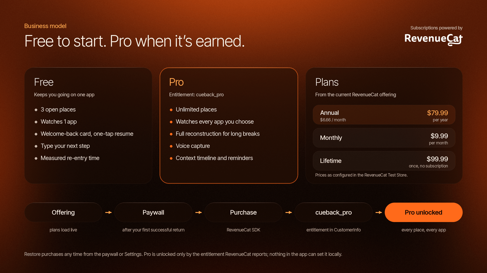

# Business model

CueBack is a freemium Android app. The Free plan solves the core problem for one app. CueBack Pro, sold through RevenueCat, removes the limits for people whose work spans several apps and several unfinished tasks at once.

This document explains who pays and why, what each plan includes, how the paywall is placed, and how RevenueCat is wired into the app. It describes the product as it is built today. It contains no revenue or user numbers: CueBack is not on the Play Store yet, and the RevenueCat dashboard holds only Test Store sandbox data from our own testing.

  

## 1. Who pays, and why

Interruptions cost people their place in the work, not the goal. The cost grows with the number of things someone is juggling. That gives CueBack a natural line between Free and Pro:

- **One task in one app** (a problem set in the browser) is fully covered by Free. That's enough for someone to feel the product work.
- **Several tasks across several apps** (a lecture video, a code review, a research article and an application form, all half-finished) is where the Free limits start to bite, and where CueBack saves the most time.

The people most likely to pay are the ones with the most open loops:

| Who | What they juggle | What makes Pro worth it |
|---|---|---|
| Students | Problem sets, lecture videos, readings, group chats pulling them away | More than one watched app, more than three open places, voice capture |
| Developers | Code reviews, docs, issue threads on the phone | Full reconstruction after a long break, the context timeline |
| Researchers and writers | Several articles and drafts at once | Unlimited open contexts, one smart reminder for work left waiting |
| Anyone filling long forms | Applications and forms left half-done | Reminders and the saved link to the exact page |

These are the groups the product is designed for. We haven't validated willingness to pay with real customers yet; that's what the pricing experiments below are for.

## 2. Free and Pro

The limits come straight from [`FeatureGate.kt`](../app/src/main/java/com/cueback/app/billing/FeatureGate.kt), where `FREE_OPEN_CONTEXTS = 3` and `FREE_TRACKED_APPS = 1`.

| | Free | Pro |
|---|:---:|:---:|
| Apps watched for automatic pause and return detection | 1 | Unlimited |
| Open contexts (saved places) | 3 | Unlimited |
| Welcome-back card: micro cue and recovery card | Yes | Yes |
| Full reconstruction for long breaks | Capped to the recovery card | Yes |
| Voice capture of the next step | No | Yes |
| Context timeline | No | Yes |
| One smart reminder for a context left waiting | No | Yes |
| Manual "Save my place" and share to CueBack | Yes | Yes |
| Re-entry measurement ("Back in 21 seconds") | Yes | Yes |
| JSON export and delete everything | Yes | Yes |
| Optional cloud AI with your own endpoint | Yes | Yes |

How the limits behave:

- **Watched apps.** If a Free user picks several apps, CueBack watches the first one (alphabetically by package name) and marks the others "Selected, active with Pro".
- **Open contexts.** Saving a fourth place by hand shows "Free keeps 3 open contexts. Complete one first, or upgrade to Pro." When automatic detection creates a fourth, CueBack archives the oldest one instead of blocking, so the core loop never stops working.
- **Recovery depth.** The engine may choose a full reconstruction after a long break; on Free it's shown as the recovery card instead.
- **Never paywalled:** data export, delete everything, and the welcome-back card itself. Data portability and the core promise stay free.

## 3. Plans and prices

The app doesn't hard-code products. It shows whatever packages the **current offering** in RevenueCat contains, with prices formatted by the store. The Test Store configuration used for development and the demo has three:

| Plan | Price (Test Store configuration) | Notes |
|---|---|---|
| Annual | $79.99 per year | Listed first and selected by default; the paywall also shows its per-month price |
| Monthly | $9.99 per month | The lowest commitment |
| Lifetime | $99.99 once | For people who don't want a subscription |

These prices are a starting point, not a market finding. An earlier planning document ([MONETIZATION.md](MONETIZATION.md)) sketched lower subscription prices; the final Google Play prices will be set by experiment (see section 7). If a product has a free trial, the paywall shows it ("7-day free trial, then …") and the button changes to "Start free trial".

## 4. When the paywall appears

The paywall appears **after the user's first successful return**, not at install and not during onboarding.

The rule is in `shouldShowPaywallAfterSuccess()` in [`WarmStartScreen.kt`](../app/src/main/java/com/cueback/app/ui/warmstart/WarmStartScreen.kt):

1. The user comes back to a paused task and the welcome-back card opens.
2. They tap Resume and get back to real work. CueBack measures it: "Back in 21 seconds".
3. When they continue from that result, the paywall opens, **once**, and only if billing is configured and the user isn't already Pro.

The headline is "Keep that continuity across every project." It lands at the moment the user has just felt the product work, so it asks for money in exchange for more of something they've already seen, not for a promise.

The paywall never blocks the core loop:

- **Continue free** is always one tap away, next to **Restore purchases**.
- After that first time, the paywall opens only when the user reaches for it: a **See Pro** button (Settings → Subscription, the app picker, a context's timeline) or a tap on a Pro feature such as voice capture, the full reconstruction or reminders.
- When the user already has Pro, the plans and purchase controls are hidden and the screen says "You have CueBack Pro."

## 5. How RevenueCat is integrated

All billing code lives in [`app/src/main/java/com/cueback/app/billing/`](../app/src/main/java/com/cueback/app/billing/).

### Configuration

- `BillingRepository.configure()` starts the SDK with the public key from `local.properties` and a random app user ID generated on the phone (`cb_…`). There is no CueBack account, so RevenueCat never receives a name or email.
- It listens for customer info updates, so entitlement changes reach the UI as soon as the SDK sees them.
- If the SDK fails to start, the error is caught and shown in Settings; free features keep working.

### Offerings

`plans()` reads `Purchases.awaitOfferings().current` and turns each package into a plan row with the store-formatted price, the per-month price for annual, and any free trial. If there is no current offering, the paywall says so instead of showing placeholder prices.

### Purchase and restore

- `purchase()` calls `awaitPurchase` with the selected package, then checks the entitlement in the returned customer info.
- Cancelled purchases show "Purchase cancelled. Nothing was charged."; pending payments say Pro unlocks when Google Play confirms; failures show the store's message.
- `restore()` calls `awaitRestore` and reports clearly when there's nothing to restore: "No active CueBack Pro purchase found for this Google account."

### The entitlement is the single source of truth

Pro is unlocked only when the RevenueCat entitlement **`cueback_pro`** is active in `CustomerInfo`. Nothing in the app can set Pro locally. The state is a sealed type:

| State | Meaning |
|---|---|
| `NotConfigured` | No RevenueCat key in this build. Billing screens say so; Pro isn't available |
| `Loading` | Waiting for customer info |
| `Free` | No active `cueback_pro` entitlement |
| `Pro(isTrial, expiresAt, willRenew)` | Active entitlement, with trial and renewal details for Settings |
| `Error` | RevenueCat unreachable and no cached info. Treated as Free |

Every Pro check in the app goes through `FeatureGate`, which reads only this state. Product IDs are free-form, because the app keys off the entitlement, not the product.

### Test Store for development, Google Play for release

- **Development** uses a RevenueCat Test Store key (`test_…`), which simulates purchases without Google Play. It works only in debug builds.
- **Release builds** drop a `test_` key on purpose and build with billing disabled, with a Gradle warning, because the SDK crashes with a Test Store key in a non-debuggable build. Release uses the Google Play public key (`goog_…`).

### Verified on a real phone

On a Moto g34 (Android 15) with the Test Store configuration:

- plans load live from the current offering (monthly, annual and lifetime);
- a valid purchase unlocks `cueback_pro` and survives an app restart;
- Restore works;
- failed and cancelled purchases show clear messages;
- the purchase controls hide once the user has Pro.

## 6. What RevenueCat gives us

- **Pricing without app releases.** Because the app reads the current offering at runtime, packages and prices can change from the dashboard.
- **Experiments.** RevenueCat can serve different offerings to different users, which is how we plan to test price points, a free trial and the lifetime option.
- **Charts and customer history.** Conversions, active subscriptions, renewals and churn, plus a per-customer page that shows which entitlements someone holds. That page is the first place to look when a purchase doesn't unlock Pro.
- **Receipt validation and entitlement logic** handled server-side by RevenueCat, so CueBack doesn't need a backend of its own.

We also record a small, content-free funnel on the device (paywall viewed, trial started, purchase completed, purchase failed, restore completed). Purchase and trial events, along with accepted welcome-back cards, are also sent as OneSignal outcomes, and the user's Pro state is a OneSignal tag. None of this includes task content.

## 7. Monetization roadmap

Planned, not yet done:

1. **Google Play release:** create the subscriptions and the lifetime product in Play Console, attach them to `cueback_pro` and the current offering, and ship with the `goog_` key.
2. **Price experiment:** compare the current prices against lower ones, with annual as the default.
3. **Free trial on annual** (the earlier plan suggested 7 days), tested against no trial.
4. **Paywall copy variants**, still shown only after the first successful return.
5. **Judge and promo access**, so evaluators can try Pro without paying.
6. Optionally, a web funnel: a "how much do interruptions cost you?" calculator that links to the app. See [MONETIZATION.md](MONETIZATION.md) for the sketch.

We'll report results from the dashboard honestly once there are real users.

## 8. Costs

CueBack has no server. Detection, storage and the context engine all run on the phone, so each extra user adds no hosting cost for us. The main costs are the store's fee on each sale and the RevenueCat and OneSignal plans as usage grows.
