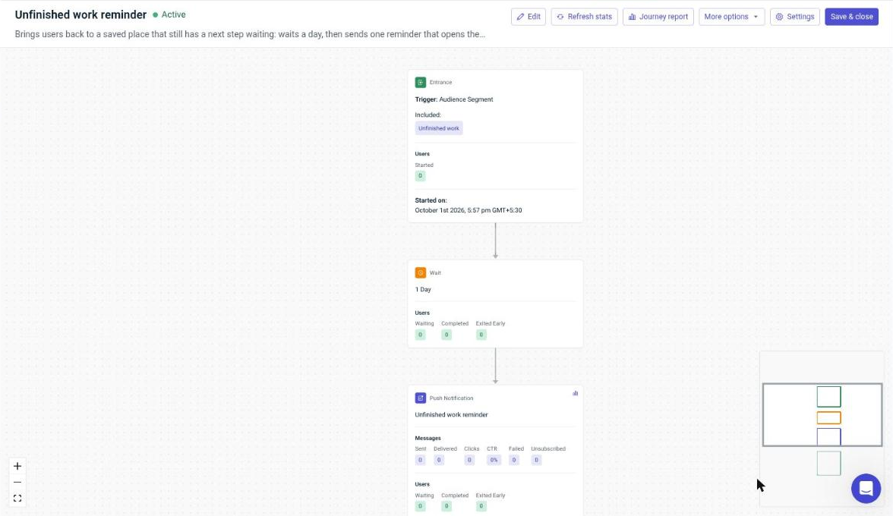
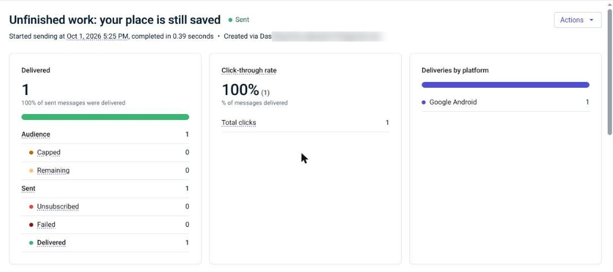

# Bringing people back with OneSignal

CueBack exists to get people back to unfinished work, so OneSignal is part of the core product, not an add-on. This page describes the integration and the campaign that is live today.

## The integration

- **SDK and delivery.** OneSignal Android SDK 5.10, delivered through Firebase Cloud Messaging. Each install logs in with a random on-device ID (no account, no email).
- **Privacy-safe tags.** After every detection pass, CueBack syncs counts and timestamps only. Task titles, notes, links and app names never leave the phone.

  | Tag | Meaning |
  |---|---|
  | `open_contexts` | Saved places that are still open |
  | `unresolved_with_next` | Open places that have a next step written down |
  | `last_pause_at` | When the most recent place was paused (Unix seconds) |
  | `use_case` | Study, coding, writing, research, design or general |
  | `pro` | `1` with CueBack Pro, otherwise `0` |

  Demo places are never counted. Deleting all data removes the tags and logs out of OneSignal.
- **Deep links on tap** (`notify/PushService.kt`). A push with a `context_id` in Additional Data opens that place's welcome-back card; a launch URL such as `cueback://library` opens that screen.
- **Outcomes.** `notification_opened` and `warm_start_accepted` are reported as OneSignal outcomes.
- **Reliability.** If OneSignal fails to start, the app keeps working, and CueBack's own local "You're back" notifications don't depend on push at all.

## The live campaign: "Unfinished work"

Built in the OneSignal dashboard on 1 October 2026.

1. **Segment "Unfinished work":** User Tag `unresolved_with_next` greater than `0`. These are people who saved a place and wrote down their next step, but haven't finished it.
2. **Message:** title "Your place is still saved", body "You left a next step waiting. Tap to pick up where you stopped.", launch URL `cueback://library`.
3. **Journey "Unfinished work reminder" (active):** Entry on the segment → wait 1 day → send the push → exit.
   - Exit early if the user opens CueBack on their own (no reminder needed), or no longer matches the segment (the work is done).
   - Users can enter the Journey only once, so nobody gets nagged.

## Results so far

The app hasn't launched publicly, so these numbers come from our own test phone (Moto g34, Android 15).

- **Delivery and click:** a one-off send of the campaign message to the segment was delivered to 1 device and clicked once (100% click-through).
- **Landing:** tapping it opened CueBack's library, showing the saved place and its next step.

## Why this reminder is different

The message is about the user's own unfinished work, backed by a next step they wrote themselves, not a generic "we miss you". The Journey sends it at most once per person and stops as soon as they come back on their own.

CueBack's own on-device notifications go further:
- quiet hours (22:00–07:00 by default)
- at most one reminder per paused place
- a per-place mute switch
- a lock-screen privacy mode that shows only "Your next action is ready"

These rules apply to the app's local notifications. The OneSignal push is limited by the Journey's settings instead.

## What's next

- Test the reminder delay: one day vs. the same evening.
- Personalize the message with the number of places waiting (`open_contexts`).
- Send an in-app message to users who come back without opening a place.
